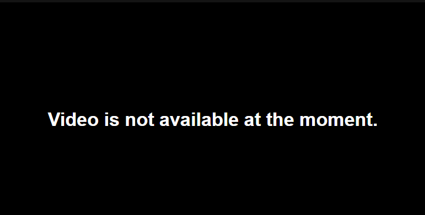

## PodoList

你肯定喜欢的待办列表软件

[点击下载-0.1.0-beta-5](https://github.com/podolist/podo/releases/download/0.1.0-beta-5/podo.apk)

> 当然你可以随意下载代码自己使用工具打包

### 如果你对这张图片感兴趣，这款软件就一定适合你

---

### 清爽的列表

还能添加表情来代表你的心情

### 学习功能

输入了 `pornhub` 作为你的代表事项，试试点击它吧

### 下载学习资料

进入学习视频的详情页，页面下方即会显示下载按钮

### 选择清晰度

### 缓存列表

长按可删除噢

### 播放学习视频

### 完成今日待办

别忘了左滑删除不想要的待办

### 常见问题

---

#### F: 我打不开学习网站

#### Q: 请确保 vpn 连接正常

---

#### F:无法下载视频

#### Q:列表中长按删除，刷新页面后重试

---

#### F:想要新增学习网站

#### Q:请提 `issue`

---

最后祝大家营养在线 ~
